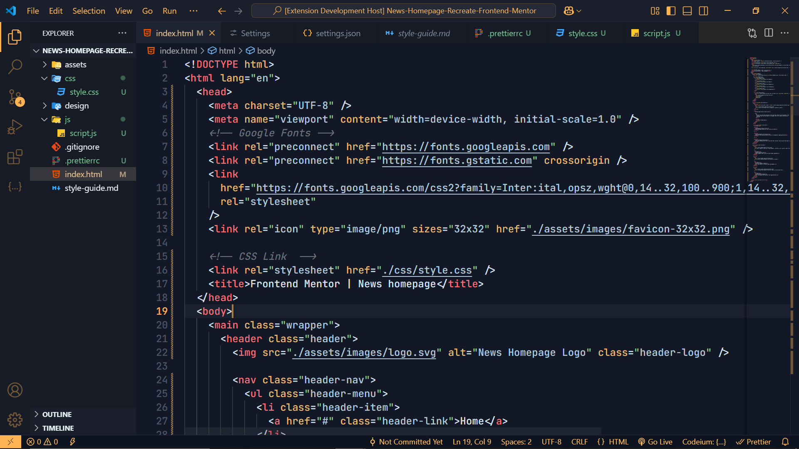

# Vedic Code Pro  

**A Cosmic Syntax Experience** ✨  
_Where Ancient Vedic Wisdom Meets Modern Code Enlightenment_

## Vedic Dark



## 🌟 Installation

```bash
# Via VS Code
1. Open Extensions (Ctrl+Shift+X)
2. Search "Vedic Code Pro"
3. Install & Reload
4. Activate with Ctrl+K Ctrl+T
```

## Vedic Philosophy Integration

- **Dharma**: Balanced color relationships
- **Karma**: Context-aware syntax highlighting
- **Moksha**: Zero visual fatigue guarantee

## Enterprise Features

- Military-grade color stability
- 24/7 theme support rotation
- Semantic versioning compliance

## Working with Markdown

You can author your README using Visual Studio Code. Here are some useful editor keyboard shortcuts:

- Split the editor (`Cmd+\` on macOS or `Ctrl+\` on Windows and Linux).
- Toggle preview (`Shift+Cmd+V` on macOS or `Shift+Ctrl+V` on Windows and Linux).
- Press `Ctrl+Space` (Windows, Linux, macOS) to see a list of Markdown snippets.

## License

[MIT](./LICENSE.txt)

## Credits

- [**Vedic Code Pro**](https://github.com/AnshMittal86/VedicCodePro) by [Ansh Mittal](https://github.com/AnshMittal86)
